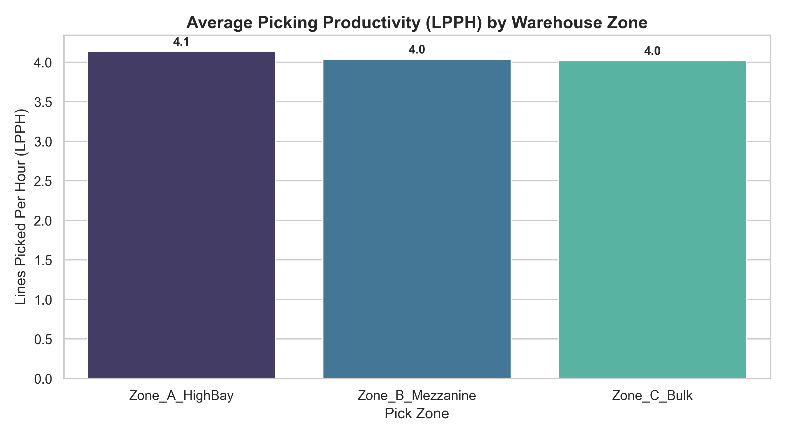

# Warehouse Operations & WMS Performance Analytics Engine

## Overview
This project processes event logs from a Warehouse Management System (WMS) to audit fulfillment center productivity, receiving cycle times, storage space efficiency, and picking precision.

---

## Core Warehouse Operational Metrics

### 1. Dock-to-Stock Cycle Time (Hours)
Measures the duration from dock arrival to putaway stock availability:
$$\text{Dock-to-Stock Time} = \text{Putaway Timestamp} - \text{Receiving Timestamp}$$

### 2. Order Pick Accuracy Rate (%)
Evaluates order picking precision before shipping:
$$\text{Pick Accuracy \%} = \left( \frac{\text{Perfect Order Picks}}{\text{Total Pick Lines Executed}} \right) \times 100$$

### 3. Lines Picked Per Hour (LPPH)
Tracks picker labor productivity across facility zones:
$$\text{LPPH} = \frac{\text{Total Pick Lines Executed}}{\text{Total Labor Hours Completed}}$$

### 4. Storage Cube Utilization (%)
Measures 3D rack space usage against total facility capacity:
$$\text{Cube Utilization \%} = \left( \frac{\text{Occupied Volume (m}^3\text{)}}{\text{Location Capacity (m}^3\text{)}} \right) \times 100$$

---

## Productivity Visual Report



---

## Repository Structure

```text
warehouse_kpi_project/
│
├── README.md                     <-- Documentation
├── requirements.txt              <-- Python dependencies
├── .gitignore                    <-- Exclusion rules
│
├── data/
│   ├── raw/
│   │   └── wms_event_log.csv     <-- Raw event log
│   └── processed/
│       └── warehouse_kpi_summary.xlsx
│
├── src/
│   ├── generate_wms_data.py      <-- Dataset generator
│   └── analyze_wms_kpis.py       <-- Audit calculation engine
│
└── reports/
    └── picking_productivity_chart.png